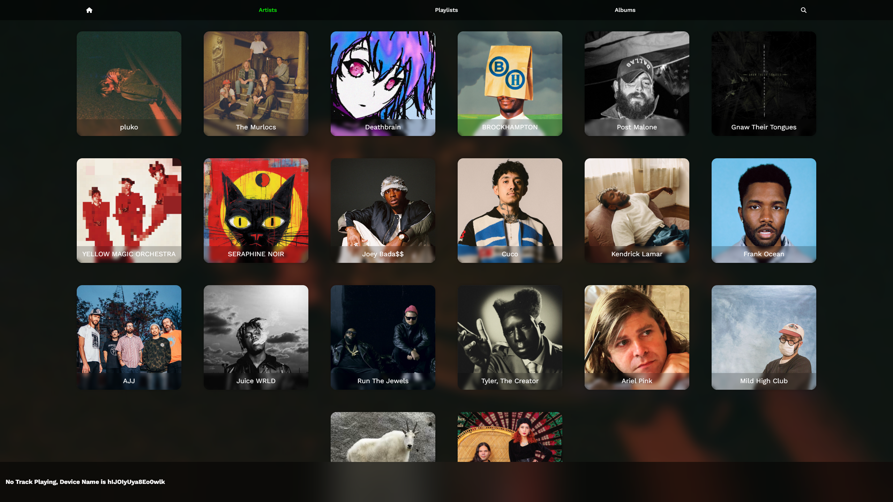
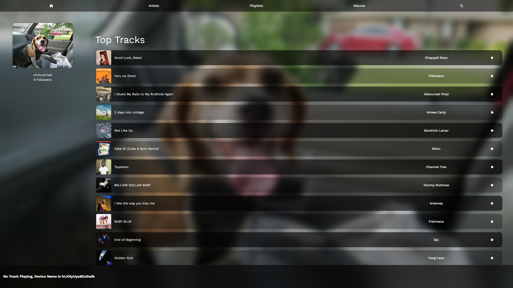
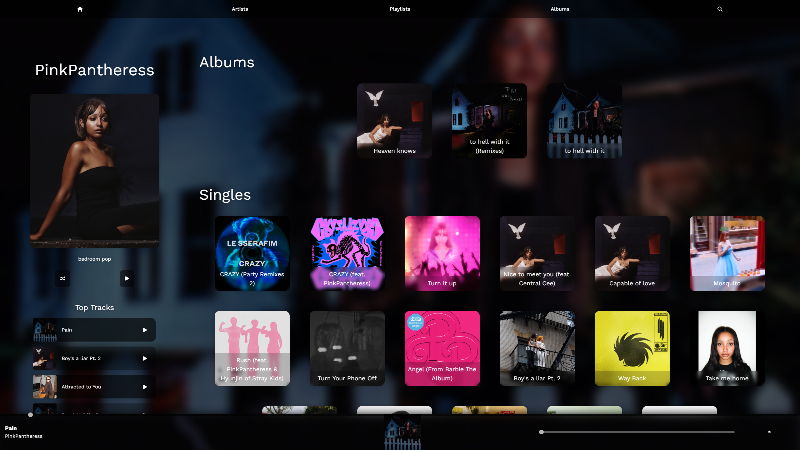
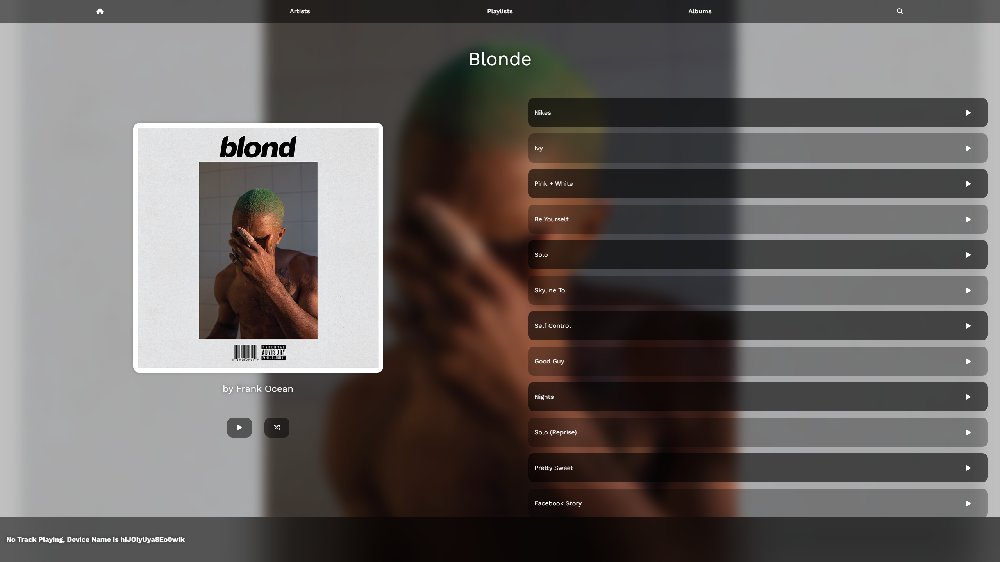
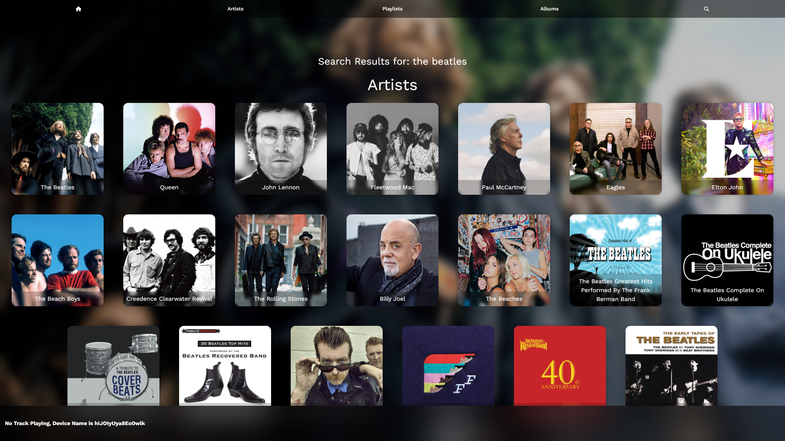
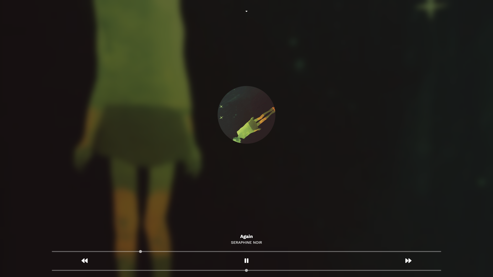

# Good Vibes

Good Vibes is a web based Spotify music player written in React and powered by Vite.
It showcases how to integrate the [Spotify Web API](https://developer.spotify.com/documentation/web-api/) 
and the [Spotify Web Playback SDK](https://developer.spotify.com/documentation/web-playback-sdk) to browse your
music collection and control playback directly in the browser.



## Features

- **Spotify Login** – authenticate using your Spotify account to access your library
- **Playlists, Albums & Artists** – browse your playlists, saved albums and followed artists
- **Search** – find tracks, artists and albums using Spotify search
- **Web Playback** – play music without leaving the page using the Spotify Web Playback SDK
- **Full Screen Player** – optional overlay for an immersive listening experience

## Getting Started

1. **Clone the repository**

   ```bash
   git clone <repo-url>
   cd good-vibrations
   ```
2. **Install dependencies**

   ```bash
   npm install
   ```
3. **Create a `.env` file** in the project root with your Spotify credentials. These values can be obtained from
the [Spotify Developer Dashboard](https://developer.spotify.com/dashboard).

   ```env
   VITE_SPOTIFY_CLIENT_ID=<your-client-id>
   VITE_SPOTIFY_CLIENT_SECRET=<your-client-secret>
   VITE_CALLBACK_URL=http://localhost:8675/spotify
   VITE_APP_NAME=GoodVibes
   ```
4. **Run the development server**

   ```bash
   npm run dev
   ```

   The application will be available at [http://localhost:8675](http://localhost:8675).

5. **Build for production** (optional)

   ```bash
   npm run build
   npm run preview
   ```

## Usage

After logging in you will land on the **Home** page which displays your profile, top tracks and top artists.
Use the navigation links to explore:

- **Playlists** – view your playlists and open individual lists for track details
- **Albums** – browse saved albums
- **Artists** – see the artists you follow and inspect their discography
- **Search** – press <kbd>Ctrl</kbd> + <kbd>F</kbd> or use the search icon to find any track, album or artist

The player bar at the bottom lets you play, pause and skip tracks. When streaming on another device,
you can transfer playback to the web player by clicking the banner that appears.

## Limitations

- A **Spotify Premium** subscription is required for full playback using the Web Playback SDK.
- Playback only works while the browser window remains open and focused.
- Music cannot be played offline and audio quality is subject to the browser's capabilities.
- When listening on another device you must transfer playback to the browser before controls are active.

## Screenshots

A few captures showing various screens are available in the [`screenshots/`](screenshots) directory:

### Home

### Artists

### Artist Page

### Album Page

### Search

### Now Playing

## License

This project is provided for educational purposes. You are free to fork and adapt it for your own use.
